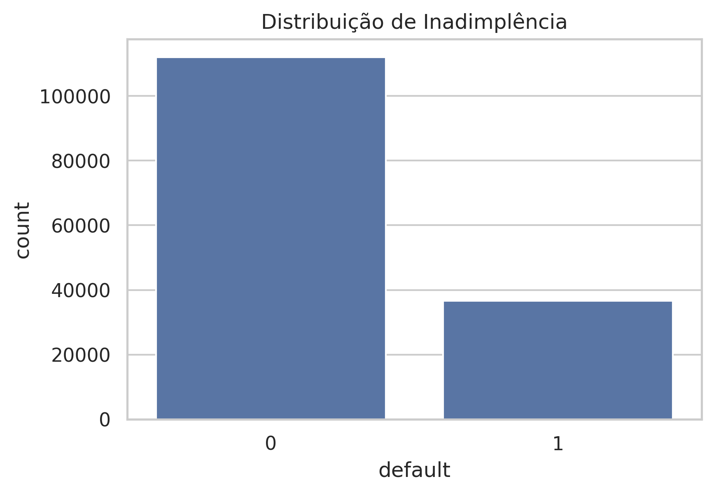
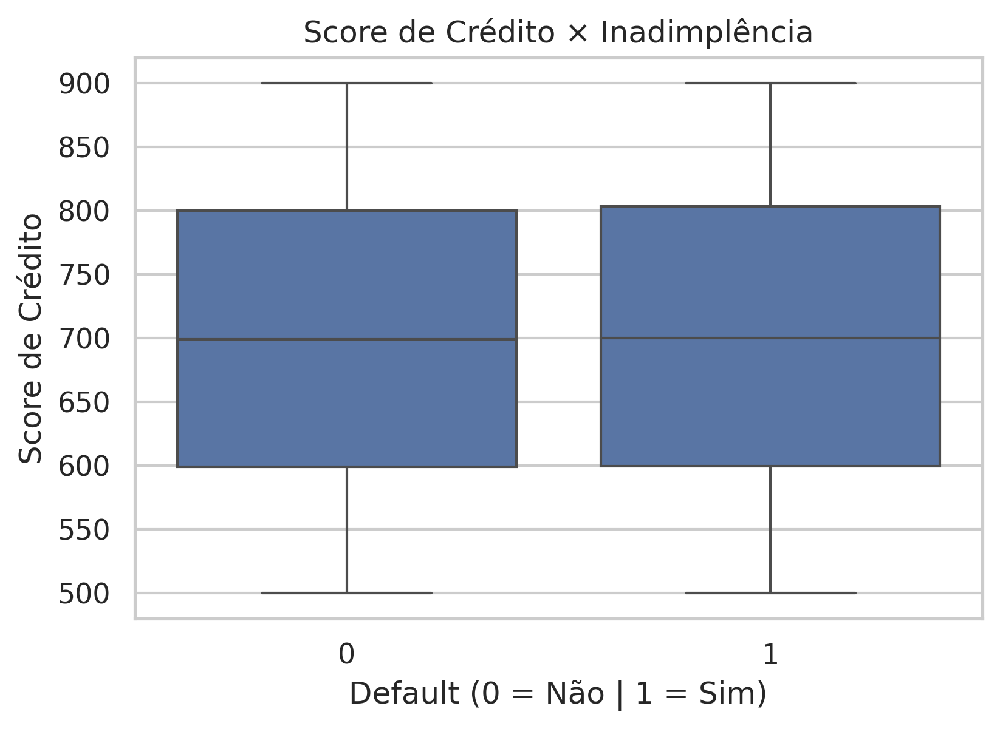
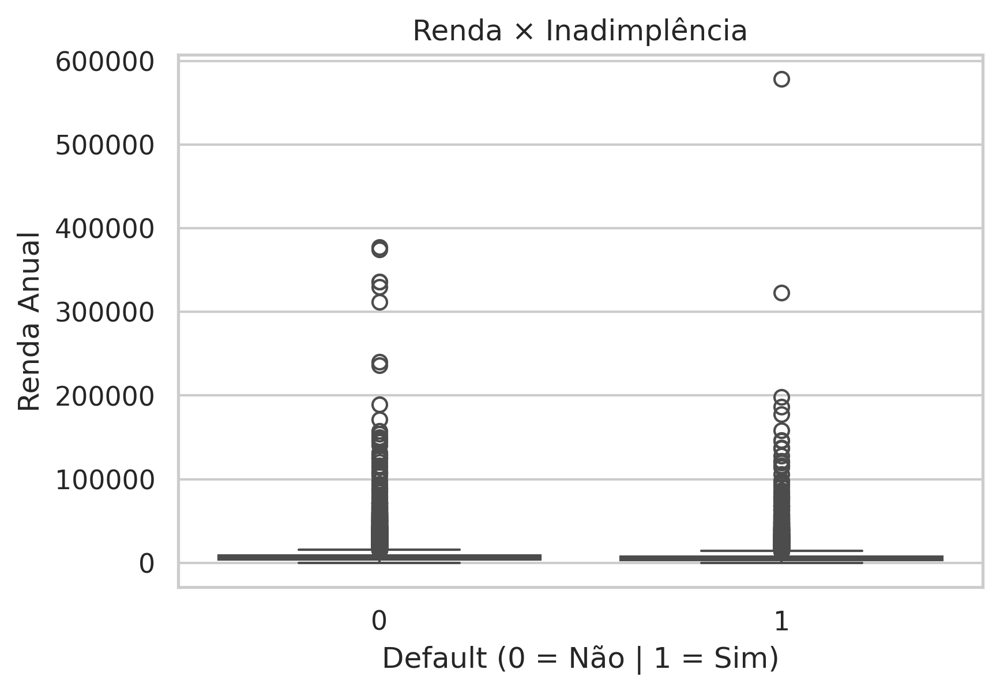
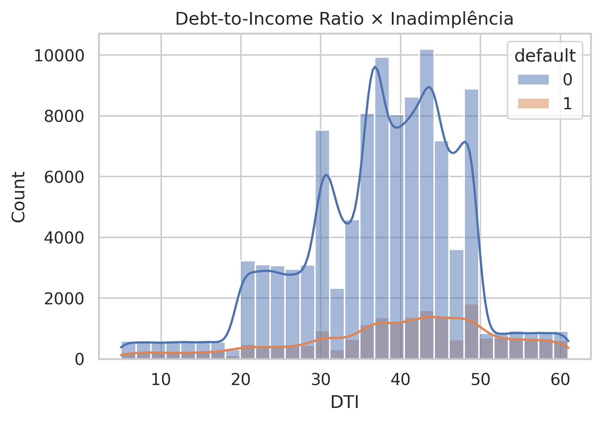

# Credit Risk Analysis — Loan Default Dataset

## 📌 Sobre o Projeto
Este projeto apresenta uma análise exploratória de dados (EDA) voltada para **risco de crédito**, utilizando um dataset de empréstimos com informações financeiras e demográficas dos clientes.

O objetivo é entender **quais fatores estão associados à inadimplência (default)**, reproduzindo análises comuns em áreas de crédito, risco e concessão de empréstimos em instituições financeiras.

---

## 🏦 Contexto Financeiro
No setor financeiro, **default** ocorre quando o cliente não cumpre as obrigações de pagamento do empréstimo conforme o contrato.

- `Default = 0` → Cliente adimplente  
- `Default = 1` → Cliente inadimplente  

Identificar padrões associados ao default é essencial para:
- concessão de crédito
- gestão de risco
- definição de taxas de juros
- prevenção de perdas financeiras

---

## 📊 Principais Análises Realizadas

### 1️⃣ Distribuição de Inadimplência
Análise da proporção entre clientes adimplentes e inadimplentes, validando a base como representativa de cenários reais de crédito.

Observa-se que a maioria dos contratos não entrou em default, mas uma parcela
relevante apresenta inadimplência, indicando risco significativo na carteira.

### 2️⃣ Score de Crédito × Default
Avaliação da relação entre score de crédito e inadimplência, evidenciando que clientes inadimplentes tendem a apresentar scores mais baixos.

Observa-se que clientes inadimplentes apresentam, em média, scores de crédito mais baixos, reforçando a relevância do score como indicador de risco, embora não seja determinístico.

### 3️⃣ Renda × Default
Análise da distribuição de renda entre clientes adimplentes e inadimplentes, mostrando que renda isoladamente não elimina o risco de crédito.

### 4️⃣ Debt-to-Income Ratio (DTI) × Default
Estudo do comprometimento da renda com dívidas, destacando o DTI como um dos principais indicadores de risco utilizados por bancos.

Observa-se que clientes com maior Debt-to-Income Ratio apresentam maior propensão à inadimplência, reforçando o DTI como um dos principais indicadores utilizados em análises de crédito.

---

## 📈 Principais Insights
- Clientes inadimplentes apresentam, em média, **menor score de crédito**
- **Alto comprometimento da renda (DTI)** está fortemente associado ao default
- Renda elevada não garante adimplência
- O risco de crédito deve ser avaliado de forma **multivariada**

---

## 🛠️ Tecnologias Utilizadas
- Python
- Pandas
- Matplotlib
- Seaborn
- Jupyter Notebook

---

## 🚀 Próximos Passos
- Criação de modelo de **Credit Scoring**
- Aplicação de Machine Learning para previsão de default
- Avaliação de métricas como ROC-AUC e Recall

---

## 📎 Dataset
- **Fonte:** Kaggle – Loan Default Dataset  
- **Link:** https://www.kaggle.com/datasets/yasserh/loan-default-dataset
- **Registros:** ~150 mil  
- **Observação:** O dataset não está versionado neste repositório por questões de tamanho.

